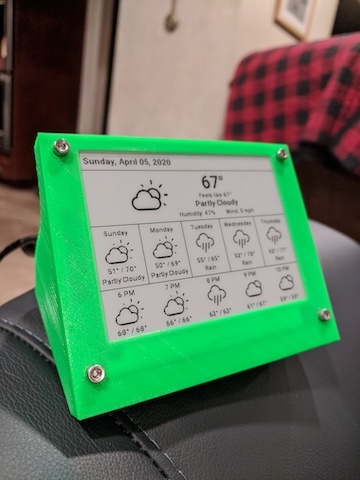

# Weatherbox 

Weatherbox is a simple weather display built with a Raspberry Pi and a [Waveshare ePaper display](https://www.waveshare.com/wiki/4.2inch_e-Paper_Module). 

## Installation and setup

### Software Setup

First, install Node.js. Make sure to download the version of Node.js that corresponds to your Raspberry Pi's architecture.

For Raspberry Pi 4/3 B+ (armv7l):

```bash
$ wget https://nodejs.org/dist/latest-v12.x/node-v12.6.0-linux-armv7l.tar.gz
$ tar -xzf node-v12.6.0-linux-armv7l.tar.gz
$ sudo cp -R node-v12.6.0-linux-armv7l/* /usr/local/
```

For Raspberry Pi Zero (armv61):

```bash
$ wget https://nodejs.org/dist/v11.15.0/node-v11.15.0-linux-armv6l.tar.gz
$ tar -xzf node-v11.15.0-linux-armv6l.tar.gz
$ sudo cp -R node-v11.15.0-linux-armv6l/* /usr/local/
```

Next, install the libraries required for the display:

```bash
$ sudo apt install python3-pip
$ sudo apt install python-imaging
$ sudo pip3 install spidev
$ sudo pip3 install RPi.GPIO
$ sudo pip3 install python-pil
$ sudo apt install fonts-roboto
$ pip install pyyaml
```

Now, go to [Darksky](https://darksky.net/dev) and [ipstack](https://ipstack.com/) and get API keys for both. Insert them into `weatherbox_server/src/internal/config/darksky-config.json` and `weatherbox_server/src/internal/config/ipstack-config.json` respectively.

(Optional) You can set your location in `weatherbox_client/config/weatherbox-config.yaml`. Go [here](https://www.latlong.net/) to get your location. If you choose not to set your location, the ipstack API will do a geolocation based on your ip address. 

Finally, since the Waveshare display uses the SPI interface, it has to be enabled on the Raspberry Pi. You can find a guide to do that [here](https://www.raspberrypi-spy.co.uk/2014/08/enabling-the-spi-interface-on-the-raspberry-pi/).

### Hardware Connection

| ePaper | Raspberry Pi (GPIO) |
|--------|---------------------|
| 3.3V   | 3.3V                |
| GND    | GND                 |
| DIN    | 19                  |
| CLK    | 23                  |
| CS     | 24                  |
| DC     | 22                  |
| RST    | 11                  |
| BUSY   | 18                  |

### Cronjob Setup

To have the display update automatically, schedule a cronjob:

```bash
$ cd cronjob
$ ./add_cronjob.sh
```

The display updates every hour, but you can edit to `cronjob/weatherbox` to have the display update at different frequencies.

